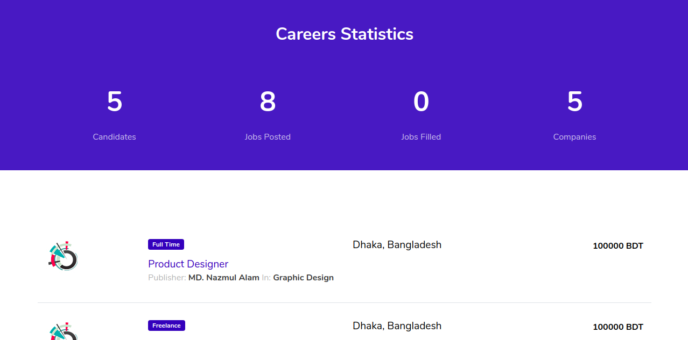
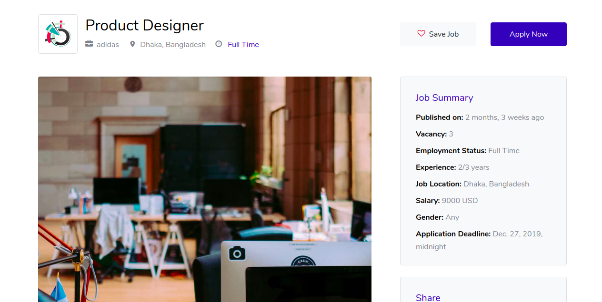
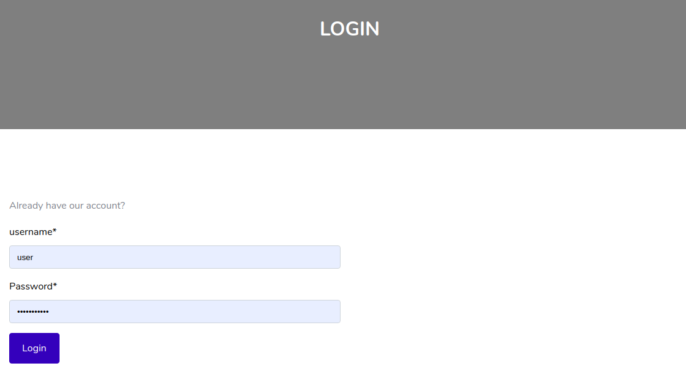

# django-job-portal
Job portal application using django
### Live : [Demo](https://job-portal-11.herokuapp.com/)
### DATABASE
#### Local : Sqlite
#### Live : postgresql

## Screen Shots
 
 

 

 

 

 

 

  
  

 

